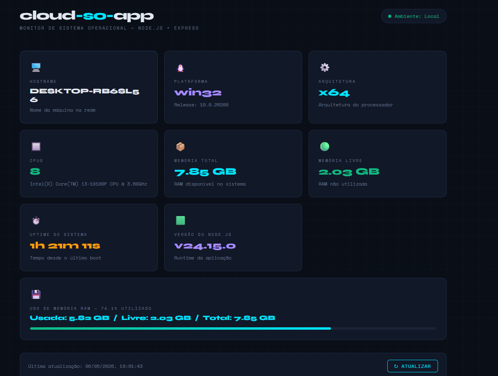

# Manual da Atividade — Cloud SO App

## Links do Projeto

**Repositório no GitHub:**  
https://github.com/marcellegg/cloud-so-app

**Aplicação publicada no Render:**  
https://cloud-so-app-iq0d.onrender.com/

---

## Teste Online no Render

A aplicação está disponível online no seguinte endereço: https://cloud-so-app-iq0d.onrender.com/

---

## Imagem do Teste Localhost

> <p align="center">
  
  <br>
</p>


---

## 1. Introdução

Este manual documenta o desenvolvimento da atividade prática da disciplina de **Nuvem e Sistemas Operacionais**.

A proposta da atividade foi criar uma aplicação web utilizando **Node.js** e **Express.js**, capaz de exibir informações do sistema operacional por meio do módulo nativo `os` do Node.js.

A aplicação foi testada em ambiente local e posteriormente publicada em ambiente de nuvem utilizando a plataforma **Render**.

O objetivo principal foi comparar a execução local com a execução em nuvem, observando diferenças relacionadas ao sistema operacional, hostname, CPU, memória e tempo de atividade do sistema.

---

## 2. Objetivo da Atividade

O objetivo da atividade foi desenvolver uma aplicação chamada `cloud-so-app`, que exibe informações do sistema operacional, como:

- Nome do host;
- Plataforma do sistema operacional;
- Arquitetura do processador;
- Quantidade de CPUs;
- Modelo da CPU;
- Memória total;
- Memória livre;
- Tempo de atividade do sistema.

Além disso, a atividade também teve como objetivo publicar a aplicação em ambiente de nuvem utilizando o Render e comparar os dados exibidos no ambiente local com os dados exibidos no ambiente cloud.

---

## 3. Tecnologias Utilizadas

As tecnologias utilizadas no projeto foram:

- **Node.js**: ambiente de execução JavaScript no backend;
- **Express.js**: framework utilizado para criação do servidor web;
- **CORS**: mecanismo de segurança que controla acesso entre domínios diferentes no navegador;
- **HTML**: estrutura da página exibida ao usuário;
- **CSS/JavaScript**: estilização visual e lógica do frontend;
- **Git**: ferramenta de controle de versão;
- **GitHub**: plataforma utilizada para hospedar o código-fonte;
- **Render**: plataforma utilizada para publicar a aplicação em nuvem;
- **PowerShell / CMD**: terminal utilizado para execução dos comandos no Windows.

---

## 4. Instalação das Ferramentas

Para desenvolver e executar o projeto, foram necessárias as seguintes ferramentas:

### 4.1 Node.js

O Node.js foi utilizado para executar a aplicação backend em JavaScript.

Para verificar se o Node.js estava instalado, foi utilizado o comando:

```
node -v
```

Também foi verificada a instalação do npm:

```
npm -v
```

O `npm` é o gerenciador de pacotes do Node.js, utilizado para instalar as dependências do projeto.

---

### 4.2 Git

O Git foi utilizado para versionar o projeto e enviar os arquivos para o GitHub.

Para verificar se o Git estava instalado, foi utilizado o comando:

```
git --version
```

Caso não esteja instalado, o download está disponível em **git-scm.com/downloads**.

---

### 4.3 Configuração Inicial do Git

Na primeira utilização, é necessário configurar nome e e-mail:

```
git config --global user.name "Seu Nome"
git config --global user.email "seu@email.com"
```

---

### 4.4 Liberação de Scripts no Windows (PowerShell)

No Windows, o PowerShell bloqueia a execução de scripts por padrão. Ao tentar executar `npm install`, pode aparecer o erro:

```
O arquivo npm.ps1 não pode ser carregado porque a execução de scripts
foi desabilitada neste sistema.
```

**Solução:** abrir o PowerShell como Administrador e executar:

```
Set-ExecutionPolicy -Scope CurrentUser -ExecutionPolicy RemoteSigned
```

Digitar **S** para confirmar. Alternativamente, utilizar o **Prompt de Comando (cmd)** no lugar do PowerShell, onde esse erro não ocorre.

---

### 4.5 Visual Studio Code

O Visual Studio Code foi utilizado como editor de código para criar e editar os arquivos do projeto.

---

### 4.6 Conta no GitHub

Foi utilizada uma conta no GitHub para criar o repositório remoto do projeto e armazenar o código-fonte da aplicação.

---

### 4.7 Conta no Render

Foi utilizada uma conta na plataforma Render para publicar a aplicação em ambiente de nuvem.

---

## 5. Criação do Projeto

O projeto foi criado dentro de uma pasta com o nome `cloud-so-app`.

Os comandos utilizados foram:

```
mkdir cloud-so-app
cd cloud-so-app
npm init -y
```

O comando `npm init -y` criou automaticamente o arquivo `package.json`, responsável por armazenar as informações do projeto, scripts e dependências.

---

## 6. Instalação das Dependências

As dependências utilizadas foram o Express.js e o CORS.

A instalação foi feita com o comando:

```
npm install express cors
```

Após a instalação, o arquivo `package.json` passou a registrar as dependências do projeto.

Também foi configurado o script de inicialização:

```json
"scripts": {
  "start": "node index.js"
}
```

Esse script permite iniciar a aplicação com o comando:

```
node index.js
```

---

## 7. Estrutura do Projeto

A estrutura final do projeto ficou organizada da seguinte forma:

```
cloud-so-app/
├── index.js
├── package.json
├── package-lock.json
├── .gitignore
└── public/
    └── index.html
```

### Descrição dos arquivos

| Arquivo/Pasta | Descrição |
| --- | --- |
| `index.js` | Arquivo principal — servidor Express e endpoint da API |
| `package.json` | Arquivo de configuração do projeto e dependências |
| `package-lock.json` | Arquivo gerado automaticamente pelo npm |
| `.gitignore` | Lista de arquivos ignorados pelo Git |
| `public/index.html` | Página web do dashboard de informações do SO |

---

## 8. Desenvolvimento da Aplicação

A aplicação foi desenvolvida utilizando Node.js, Express.js e o módulo nativo `os`.

O módulo `os` permite acessar informações do sistema operacional onde a aplicação está sendo executada.

No projeto, foram utilizadas funções como:

```js
os.hostname()    // Nome da máquina na rede
os.platform()    // Plataforma (linux, win32, darwin)
os.arch()        // Arquitetura (x64, arm64)
os.cpus()        // Array com informações de cada CPU
os.totalmem()    // Memória total em bytes
os.freemem()     // Memória livre em bytes
os.uptime()      // Tempo de atividade em segundos
process.version  // Versão do Node.js
```

Essas funções permitem obter informações como nome do host, plataforma, arquitetura, processador, memória e tempo de atividade do sistema.

---

## 9. Criação do Arquivo .gitignore

O arquivo `.gitignore` evita que a pasta `node_modules` (pesada e desnecessária no repositório) seja enviada ao GitHub.

No Windows, a forma mais simples de criar esse arquivo é pelo terminal:

```
echo node_modules/ > .gitignore
```

Outra opção é pelo **VS Code**: criar novo arquivo, nomear como `.gitignore` e salvar com o conteúdo `node_modules/`.

Pelo **Bloco de Notas**: salvar em *Todos os arquivos (*.*)* para evitar que o arquivo seja salvo como `.gitignore.txt`.

---

## 10. Funcionamento da Aplicação

A aplicação cria um servidor web utilizando o Express.js.

Quando o usuário acessa a rota principal `/`, o servidor serve a página HTML do dashboard. O JavaScript da página faz uma requisição ao endpoint `/api/sysinfo`, que coleta as informações do sistema operacional e retorna em formato JSON.

A aplicação utiliza a seguinte configuração de porta:

```js
const PORT = process.env.PORT || 3000;
```

Essa configuração é importante porque:

- Em ambiente local, a aplicação roda na porta `3000`;
- No Render, a porta é definida automaticamente pela variável de ambiente `PORT`.

---

## 11. Execução Local

Para executar a aplicação localmente, foi utilizado o terminal dentro da pasta do projeto.

Em seguida, as dependências foram instaladas:

```
npm install
```

Depois, a aplicação foi iniciada:

```
node index.js
```

O terminal exibiu a seguinte mensagem:

```
Servidor rodando em http://localhost:3000
```

Com isso, a aplicação pôde ser acessada no navegador pelo endereço:

```
http://localhost:3000
```

---

## 12. Resultado do Teste Local

Durante o teste local, a aplicação exibiu as informações do sistema operacional da máquina utilizada.

Resultado observado no ambiente local:

| Informação | Valor Local |
| --- | --- |
| Hostname | srv-d7tr3pf7f7vs73fdsh9g-hibernate-7b86b55b5b-nvxnm |
| Platform | PREENCHER |
| Architecture | PREENCHER |
| Número de CPUs | PREENCHER |
| Modelo da CPU | PREENCHER |
| Memória Total | PREENCHER GB |
| Memória Livre | PREENCHER GB |
| Uptime do Sistema | PREENCHER |
| Versão do Node.js | PREENCHER |

---

## 12. Versionamento com Git

Após a criação e teste da aplicação, o projeto foi versionado utilizando Git.

Os comandos utilizados foram:

```
git init
git add .
git commit -m "primeiro commit - cloud-so-app"
git branch -M main
```

Depois, o repositório remoto foi configurado:

```
git remote add origin https://github.com/marcellegg/cloud-so-app.git
```

Em seguida, o projeto foi enviado para o GitHub:

```
git push -u origin main
```

Durante o `git push`, o GitHub pode solicitar login. Caso peça **token** ao invés de senha, acessar:

> GitHub → Settings → Developer settings → Personal access tokens → Tokens (classic) → Generate new token

Marcar a opção **repo** e usar o token gerado como senha.

---

## 13. Publicação no GitHub

O projeto foi publicado no GitHub no seguinte repositório:

https://github.com/marcellegg/cloud-so-app

O GitHub foi utilizado para armazenar o código-fonte e permitir a integração com o Render.

---

## 14. Publicação no Render

Após o envio do projeto para o GitHub, a aplicação foi publicada na plataforma Render.

O procedimento realizado foi:

1. Acessar o painel do Render em **dashboard.render.com**;
2. Clicar em **New**;
3. Selecionar **Web Service**;
4. Conectar a conta do GitHub;
5. Escolher o repositório `cloud-so-app`;
6. Configurar o serviço como aplicação Node.js;
7. Definir os comandos de build e inicialização;
8. Criar o serviço e aguardar o deploy.

---

## 15. Configurações Utilizadas no Render

As configurações utilizadas no Render foram:

| Campo | Valor |
| --- | --- |
| Source Code | `marcellegg/cloud-so-app` |
| Name | `cloud-so-app` |
| Language | `Node` |
| Branch | `main` |
| Build Command | `npm install` |
| Start Command | `node index.js` |
| Instance Type | Free |

A aplicação foi publicada online no endereço:

https://cloud-so-app-iq0d.onrender.com/

---

## 16. Resultado do Teste no Render

Após o deploy, a aplicação foi acessada pelo navegador por meio do link público.

No ambiente Render, a aplicação exibiu informações do servidor/container em nuvem, e não da máquina local.

Resultado observado no Render:

| Informação | Valor no Render |
| --- | --- |
| Hostname | srv-d7tr3pf7f7vs73fdsh9g-hibernate-7b86b55b5b-nvxnm |
| Platform | PREENCHER |
| Architecture | PREENCHER |
| Número de CPUs | PREENCHER |
| Modelo da CPU | PREENCHER |
| Memória Total | PREENCHER GB |
| Memória Livre | PREENCHER GB |
| Uptime do Sistema | PREENCHER |
| Versão do Node.js | PREENCHER |

> Preencha os campos acima com os valores exibidos na página online do Render.

---

## 17. Comparação entre Ambiente Local e Ambiente em Nuvem

A comparação entre os ambientes permite observar que o mesmo código apresenta informações diferentes dependendo do local onde está sendo executado.

| Informação | Ambiente Local | Ambiente Render | Observação |
| --- | --- | --- | --- |
| Hostname | DESKTOP-RB6SL56 | srv-d7tr3pf7f7vs73fdsh9g-hibernate-7b86b55b5b-nvxnm | Local: nome do computador pessoal. Render: identificador interno do container em nuvem. |
| Platform | win32 | PREENCHER | Local: sistema do aluno (ex: win32). Render: normalmente Linux. |
| Architecture | x64 | PREENCHER | A arquitetura pertence a hardwares/ambientes diferentes. |
| Número de CPUs | 8 | PREENCHER | A quantidade de CPUs depende do ambiente de execução. |
| Modelo da CPU | Intel(R) Core(TM) i3-10100F CPU @ 3.60GHz | PREENCHER | Local: processador físico. Render: processador da infraestrutura do provedor. |
| Memória Total | 7.85 GB | PREENCHER | Local: RAM do computador. Render: memória disponível para o container cloud. |
| Memória Livre | 1.51 GB | PREENCHER | Varia conforme o uso do sistema em cada ambiente. |
| Uptime | 1h 13m 51s | PREENCHER | Local: tempo desde o boot da máquina. Render: tempo de atividade do container. |

---

## 18. Análise das Diferenças entre Local e Cloud

Ao executar a aplicação localmente, os dados exibidos pertencem ao computador utilizado pelo aluno. Por isso, o hostname aparece como DESKTOP-RB6SL56, a plataforma aparece como `win32`, e os dados de CPU e memória correspondem ao hardware físico.

No Render, a aplicação é executada em um ambiente remoto de nuvem. Por esse motivo, o hostname exibido é diferente, representando o identificador interno do container ou servidor utilizado pela plataforma.

Essa diferença demonstra que a mesma aplicação pode ser executada em ambientes distintos, utilizando recursos diferentes de sistema operacional, CPU, memória e infraestrutura.

O plano gratuito do Render pode colocar aplicações em hibernação após determinado período sem acesso, reativando-as quando são acessadas novamente. Por isso, o uptime no Render tende a ser bem menor do que o uptime local.

---

## 19. Relação com Conceitos de Sistemas Operacionais

A atividade permite relacionar a aplicação prática com diversos conceitos estudados em Sistemas Operacionais.

---

### 19.1 Processos

Quando a aplicação é iniciada com o comando:

```
node index.js
```

o sistema operacional cria um processo para executar o Node.js.

Esse processo fica responsável por manter o servidor Express ativo e responder às requisições feitas pelo navegador.

No ambiente local, esse processo é criado no sistema operacional Windows.  
No Render, esse processo é criado em um ambiente de nuvem, normalmente baseado em Linux.

---

### 19.2 Gerenciamento de Memória

A aplicação utiliza as funções:

```js
os.totalmem()
os.freemem()
```

Essas funções permitem visualizar a quantidade total de memória e a memória livre disponível no sistema.

Isso se relaciona diretamente ao gerenciamento de memória feito pelo sistema operacional, que controla a alocação e liberação de memória entre processos e serviços em execução.

---

### 19.3 Uso de CPU

A função:

```js
os.cpus()
```

foi utilizada para obter informações sobre os processadores disponíveis no ambiente de execução.

Com isso, a aplicação exibe a quantidade de CPUs e o modelo do processador. Esse recurso demonstra como o sistema operacional gerencia e disponibiliza informações sobre os recursos de processamento.

---

### 19.4 Sistema Operacional Hospedeiro

O sistema operacional hospedeiro é o ambiente onde a aplicação está sendo executada.

No teste local, o sistema hospedeiro foi a máquina Windows do aluno.

No Render, o sistema hospedeiro é um ambiente remoto de nuvem, gerenciado pela própria plataforma.

Essa diferença mostra que uma aplicação pode funcionar em diferentes sistemas operacionais, desde que suas dependências sejam compatíveis.

---

### 19.5 Virtualização

A computação em nuvem utiliza virtualização ou conteinerização para executar aplicações em ambientes isolados.

No Render, a aplicação não roda diretamente em uma máquina física dedicada. Ela é executada em um ambiente controlado, isolado e gerenciado pelo provedor.

Isso permite que múltiplas aplicações compartilhem a mesma infraestrutura física, mantendo separação lógica entre elas.

---

### 19.6 Computação em Nuvem

A publicação no Render representa o uso de computação em nuvem.

A aplicação deixou de estar disponível apenas no computador local e passou a ser acessível pela internet por meio de uma URL pública:

```
https://cloud-so-app-iq0d.onrender.com/
```

Isso demonstra características importantes da nuvem, como:

- Acesso remoto via internet;
- Publicação de aplicações sem necessidade de servidor físico próprio;
- Uso de infraestrutura de terceiros (provedor de nuvem);
- Escalabilidade e facilidade de deploy;
- Redução de custos operacionais.

---

## 20. Testes Realizados

### 20.1 Teste Local

O teste local foi realizado acessando:

```
http://localhost:3000
```

Resultado:

- A aplicação iniciou corretamente;
- A página foi carregada no navegador;
- As informações do sistema operacional local foram exibidas;
- O dashboard atualizou automaticamente a cada 10 segundos.

---

### 20.2 Teste no GitHub

O teste no GitHub consistiu em verificar se os arquivos foram enviados corretamente para o repositório remoto.

Foram verificados os seguintes arquivos:

```
index.js
package.json
package-lock.json
.gitignore
public/index.html
```

Resultado:

- O repositório foi criado corretamente;
- Os arquivos do projeto foram enviados sem a pasta `node_modules`;
- O histórico de commits foi registrado;
- O projeto ficou disponível para integração com o Render.

---

### 20.3 Teste no Render

O teste no Render foi realizado acessando:

```
[https://cloud-so-app-iq0d.onrender.com/]
```

Resultado:

- O deploy foi realizado com sucesso;
- A aplicação ficou disponível online;
- A página carregou corretamente;
- As informações do ambiente em nuvem foram exibidas;
- Foi possível comparar os dados locais com os dados do Render.

---

## 21. Dificuldades Encontradas

Durante o desenvolvimento da atividade, ocorreram algumas dificuldades:

**Erro de execução de scripts no PowerShell:**  
Ao tentar executar `npm install`, o PowerShell bloqueou o arquivo `npm.ps1` por política de segurança. A solução foi executar o seguinte comando como Administrador:

```
Set-ExecutionPolicy -Scope CurrentUser -ExecutionPolicy RemoteSigned
```

Alternativamente, foi utilizado o Prompt de Comando (cmd), onde o erro não ocorre.

**Criação do arquivo .gitignore no Windows:**  
O Windows não permite criar arquivos que começam com ponto diretamente pelo explorador de arquivos. A solução foi criar o arquivo pelo terminal:

```
echo node_modules/ > .gitignore
```

**Autenticação no GitHub:**  
Durante o `git push`, o GitHub solicitou token ao invés de senha. Foi necessário gerar um Personal Access Token nas configurações da conta e utilizá-lo como senha.

---

## 22. Comandos Principais Utilizados

### Instalação e execução

```
npm install
node index.js
```

### Git e GitHub

```
git init
git add .
git commit -m "primeiro commit - cloud-so-app"
git branch -M main
git remote add origin https://github.com/marcellegg/cloud-so-app.git
git push -u origin main
```

### Atualização após alterações

```
git add .
git commit -m "descricao da alteracao"
git push
```

---

## 23. Conclusão

A atividade permitiu compreender de forma prática a relação entre aplicações web, sistemas operacionais e computação em nuvem.

Por meio do desenvolvimento da aplicação `cloud-so-app`, foi possível utilizar o Node.js e o Express.js para criar um servidor web simples, capaz de consultar informações do sistema operacional utilizando o módulo nativo `os`.

Ao executar a aplicação localmente, os dados exibidos corresponderam à máquina pessoal utilizada no desenvolvimento. Já no Render, os dados exibidos corresponderam ao ambiente remoto de nuvem fornecido pela plataforma.

Essa comparação demonstrou que o mesmo código pode ser executado em ambientes diferentes, apresentando informações distintas de hostname, sistema operacional, CPU, memória e tempo de atividade.

Além disso, a atividade permitiu praticar conceitos importantes como processos, gerenciamento de memória, uso de CPU, sistema operacional hospedeiro, virtualização, cloud computing, versionamento com Git, publicação no GitHub e deploy em nuvem com Render.

Portanto, o projeto atingiu o objetivo proposto, demonstrando de forma prática a diferença entre execução local e execução em ambiente cloud.

---

## 24. Identificação

**Projeto:** Cloud SO App  
**Aluna:** Marcelle de Góes Silva.
**Disciplina:** Nuvem e Sistemas Operacionais  
**Professor:** Prof. Me. Deivison S. Takatu  
**Repositório:** [https://github.com/marcellegg/cloud-so-app]
**Aplicação Online:** [https://cloud-so-app-iq0d.onrender.com/]

