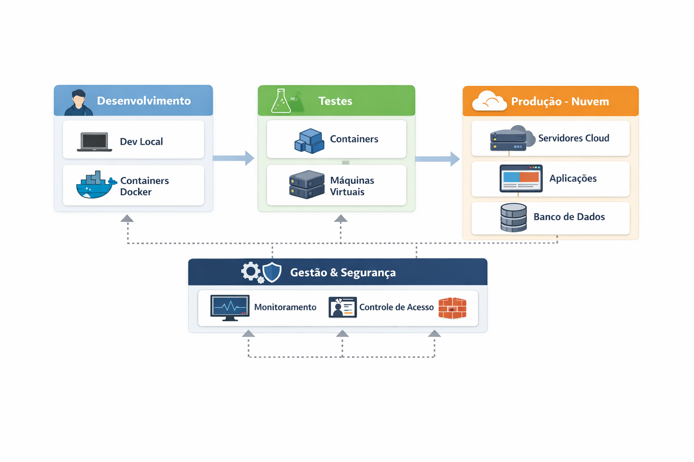

# 🚀 Planejamento de Infraestrutura – DevStore

📚 **Estudo de Caso I – Sistemas Operacionais**
👩‍💻 Disciplina: Sistemas Operacionais
👨‍🏫 Professor: Prof. Me. Deivison S. Takatu

---

## 📌 Visão Geral

A **DevStore** é uma startup focada no desenvolvimento de aplicações web que enfrenta desafios relacionados à organização, escalabilidade e segurança de sua infraestrutura de TI.

Atualmente, utiliza servidores locais sem padronização, o que dificulta a manutenção e o crescimento. Além disso, não há separação entre ambientes de desenvolvimento, testes e produção — aumentando riscos de falhas e inconsistências.

💡 Este projeto propõe uma solução moderna baseada em:

* Virtualização
* Containerização
* Computação em nuvem
* Boas práticas de segurança

---

## 🧩 Diagrama da Arquitetura

  
   
  <em>Figura 1 – Arquitetura proposta da DevStore</em>

---

## 📝 Explicação do Diagrama

O diagrama representa a organização da infraestrutura da DevStore dividida em **quatro partes principais**, mostrando como o sistema evolui desde o desenvolvimento até a produção.

### 👨‍💻 1. Desenvolvimento

Nesta etapa, os desenvolvedores trabalham em suas máquinas locais (**Dev Local**) utilizando **containers Docker**.
Isso garante que todos utilizem o mesmo ambiente, evitando problemas de compatibilidade.

➡️ O resultado dessa fase segue para testes.

---

### 🧪 2. Testes

Aqui ocorre a validação das aplicações antes de irem para produção.

* **Containers:** usados para testes rápidos
* **Máquinas Virtuais:** usadas para testes mais completos e isolados

💡 Essa combinação garante mais segurança e qualidade.

➡️ Após os testes, o sistema é enviado para produção.

---

### ☁️ 3. Produção (Nuvem)

Essa é a etapa onde o sistema fica disponível para uso real.

* **Servidores Cloud:** hospedam a aplicação
* **Aplicações:** executam os serviços
* **Banco de Dados:** armazena as informações

💡 A nuvem permite:

* Escalabilidade
* Alta disponibilidade
* Melhor desempenho

---

### ⚙️ 4. Gestão e Segurança

Essa camada atua em **todas as outras**, garantindo controle e estabilidade do sistema.

Inclui:

* 📊 Monitoramento (desempenho e falhas)
* 🔐 Controle de acesso (usuários e permissões)
* 🧱 Firewall (proteção contra ataques)

💡 Ela é conectada a todas as partes do sistema, garantindo funcionamento seguro.

---

### 🔄 Fluxo Geral

O fluxo do sistema segue esta ordem:

**Desenvolvimento → Testes → Produção**

Enquanto isso, a camada de **Gestão e Segurança acompanha todas as etapas**.

---

## ⚠️ Problemas Identificados

* Falta de padronização dos servidores
* Dependência de infraestrutura local
* Ausência de ambientes separados (dev/teste/prod)
* Falta de testes automatizados
* Inexistência de integração contínua
* Vulnerabilidades de segurança

---

## 🎯 Objetivos

* ✅ Padronizar ambientes
* ✅ Melhorar a organização da infraestrutura
* ✅ Permitir escalabilidade sob demanda
* ✅ Reduzir custos operacionais
* ✅ Aumentar a segurança dos sistemas

---

## 🏗️ Arquitetura Proposta

A solução integra quatro pilares principais:

* Virtualização
* Containerização (Docker)
* Computação em Nuvem
* Segurança da Informação

---

## 💻 Papel dos Sistemas Operacionais

Os sistemas operacionais são responsáveis por:

* Gerenciar recursos de hardware
* Executar containers e máquinas virtuais
* Garantir segurança e estabilidade

💡 Destaque: uso de **Linux** pela eficiência e estabilidade

---

## 🔄 Fluxo de Trabalho

1. Desenvolvimento local com containers
2. Testes em ambientes isolados
3. Integração contínua
4. Deploy na nuvem
5. Monitoramento contínuo

---

## 📊 Monitoramento

Permite acompanhar:

* Uso de CPU
* Memória
* Armazenamento
* Desempenho geral

---

## 🌐 Rede e Armazenamento

* Redes virtuais seguras na nuvem
* Armazenamento escalável
* Controle de acesso aos dados

---

## ⚙️ Implementação

1. Migração para nuvem
2. Padronização com containers
3. Implementação de testes automatizados
4. Configuração de monitoramento

---

## 🔧 Manutenção e Expansão

* Monitoramento contínuo
* Atualizações frequentes
* Backups periódicos
* Escalabilidade conforme demanda

---

## 💰 Análise de Custos

| Critério             | Local       | Nuvem       |
| -------------------- | ----------- | ----------- |
| Investimento inicial | 🔴 Alto     | 🟢 Baixo    |
| Escalabilidade       | 🔴 Limitada | 🟢 Alta     |
| Manutenção           | 🔴 Interna  | 🟢 Provedor |
| Disponibilidade      | 🟡 Média    | 🟢 Alta     |

---

## ✅ Conclusão

A adoção de uma infraestrutura baseada em **containers + nuvem** permite que a DevStore:

* Cresça de forma sustentável 📈
* Reduza custos 💰
* Aumente a segurança 🔒
* Melhore a organização ⚙️

---

## 📚 Referências

* TANENBAUM, Andrew S. *Sistemas Operacionais Modernos*
* Documentação Docker
* Documentação AWS
* Documentação Microsoft Azure

---

